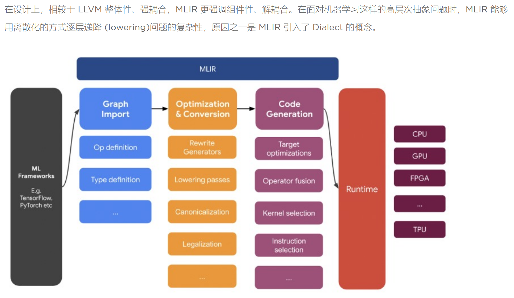

# `tpu-mlir`学习笔记
* `TPU-MLIR` 是一个专注于 `AI` 芯片的 `TPU` 编译器开源工程，提供了一套完整的工具链，可以将不同框架下预训练过的深度学习模型，转化为可以在 TPU 上运行的二进制文件 `bmodel`，从而实现更高效的推理。
* 算能 TPU 编译器开源，架起算力硬件和 AI 框架的桥梁#
开发者使用 TensorFlow、PyTorch、PaddlePaddle 等深度学习框架可以快速训练出自己的 AI 模型，但这些模型想要部署到 TPU、GPU 等终端算力设备时，需要将模型中的计算图/算子等输出为低级的机器语言更快地执行，这时 AI 编译器就有用武之地了。作为 框架和硬件之间的桥梁 ，AI 编译器可以实现一次代码开发，各种算力芯片复用的目标。
* 精度与效率并存，TPU-MLIR 实现主流框架全支持

## [慢条斯理](summary/README.md)

### `MLIR`介绍
* `MLIR`（`Multi-Level Intermediate Representation`，多级的中间表示）是一种用来构建可重用和可扩展编译基础设施的新方法，由 `LLVM` 原作者 `Chris Lattner` 在 `Google` 工作时期开发，`MLIR` 目的是做一个通用、可复用的编译器框架， 解决软件碎片化，改进异构硬件的编译，显著减少构建特定领域编译器的成本 。

* 在设计上，相较于 LLVM 整体性、强耦合，MLIR 更强调组件性、解耦合。在面对机器学习这样的高层次抽象问题时，MLIR 能够用离散化的方式逐层递降 (lowering)问题的复杂性，原因之一是 MLIR 引入了 Dialect 的概念。

## [鞭辟入里](summary/README.md)

## 参考链接
* 1 [`tpu-mlir`总体介绍](https://tpumlir.org/zh-cn/2022/08/26/tpu-mlir-zheng-shi-kai-yuan-gen-suan-neng-yi-qi-da-zao-xia-yi-dai-ai-bian-yi-qi.html)
