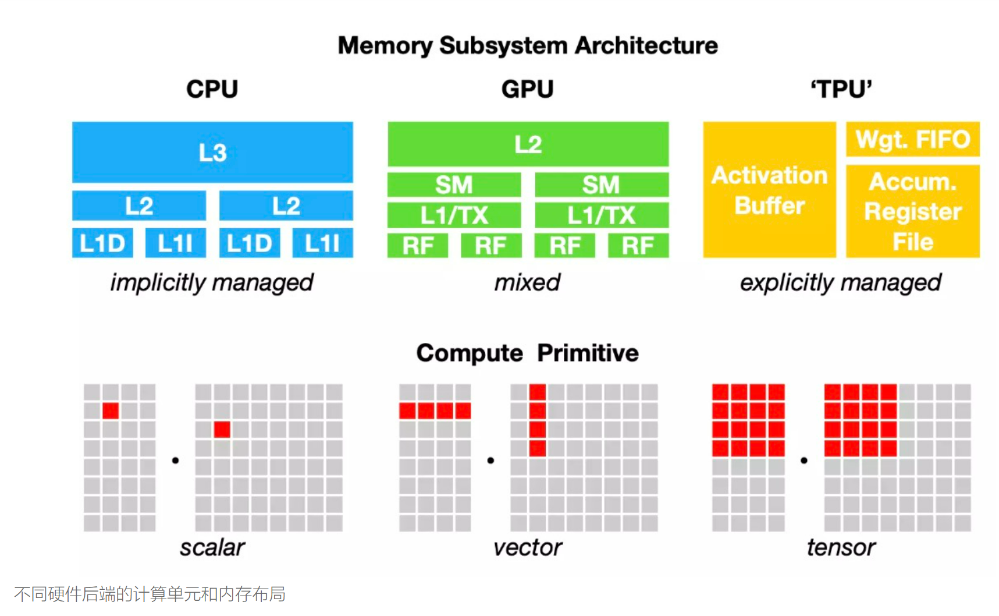
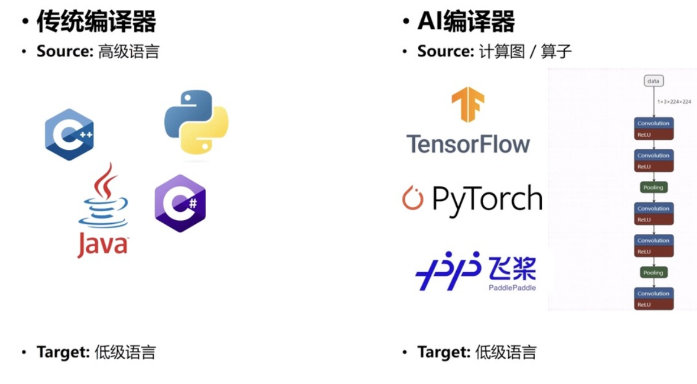
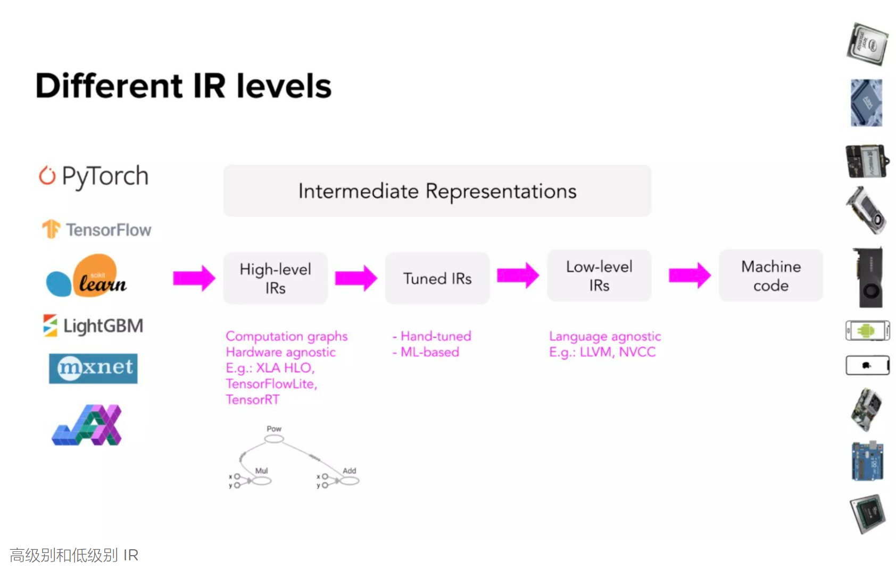

# `tpu-mlir`学习笔记
* `TPU-MLIR` 是一个专注于 `AI` 芯片的 `TPU` 编译器开源工程，提供了一套完整的工具链，可以将不同框架下预训练过的深度学习模型，转化为可以在 TPU 上运行的二进制文件 `bmodel`，从而实现更高效的推理。
* 算能 TPU 编译器开源，架起算力硬件和 AI 框架的桥梁#
开发者使用 TensorFlow、PyTorch、PaddlePaddle 等深度学习框架可以快速训练出自己的 AI 模型，但这些模型想要部署到 TPU、GPU 等终端算力设备时，需要将模型中的计算图/算子等输出为低级的机器语言更快地执行，这时 AI 编译器就有用武之地了。作为 框架和硬件之间的桥梁 ，AI 编译器可以实现一次代码开发，各种算力芯片复用的目标。
* 精度与效率并存，TPU-MLIR 实现主流框架全支持

## AI编译器
* 计算机中的传统编译器，可以将各种高级语言例如 C++、Python 等编程语言转为统一的计算机可理解的低级语言，本质上 AI 编译器与传统编译器很相似，只不过要转换的对象变为了各种深度学习框架构建和训练出来的网络，也称之为计算图，而构建这一计算图的各个小的计算模块例如 relu 和 pooling 等，也称之为算子。
* 通过高级语言可以更高效地编程，语言转换的工作直接交给编译器完成就行。传统编译器和 AI 编译器的主要区别是，前者的主要目的是为了降低编程难度，而 AI 编译器虽然也起到了简化网络搭建难度的作用，但最主要的功能是提升网络性能。
* TPU 芯片加速本质上是把一个模型拆成一个个算子，然后对每个算子进行转换，最后变成我们芯片可以理解的指令，模型的本质就是数据在一个个算子之间进行运算，然后传递到下一个算子，最后输出结果。

* AI编译器呼之欲出的需求与困境






## `IR`
* 高级 IR 通常是 ML 模型的计算图。高级别的 IR 通常是与硬件无关的(不关心它在什么硬件上运行) ，而低级别的 IR 通常是与框架无关的(不关心模型是用什么框架构建的)。



* 高级别和低级别`IR`的两个过程，分别是`Lowering`（逐层降低）以及`Opimizing`（利用硬件的特性进行特定优化）
```text
1. Lowering: 编译器为模型生成硬件机器码，让模型可以在特定硬件上运行。
2. Optimizing: 优化模型在硬件上的运行效率
在“降低”(Lowering)代码以便将模型运行到所选硬件后，可能会遇到的一个问题是性能。接下来就是`Optimizing`过程，Codegen 非常善于将 IR 降低到机器代码，但是根据目标硬件后端的不同，生成的机器代码可能不能执行得很好，生成的代码可能没有利用数据本地化和硬件缓存，也可能没有利用可以提高代码速度的向量或并行操作等高级特性。使用图优化技术结合硬件特性来研究如何将代码编译到某个特定的目标硬件加速运行。
```

## `LLVM`
* 编译器通常利用 Codegen（代码生成器）来生成机器码，这个过程也称为“lowering”，就是将高级框架代码“降低”为低级硬件机器码，这不是“翻译”，因为它们之间没有一对一的映射。AI 编译器使用的最多的是 LLVM，TensorFlow XLA、 NVIDIA CUDA 编译器(NVCC)、 MLIR (用于构建其他编译器的元编译器)和 TVM 都使用 LLVM。


## [慢条斯理](summary/README.md)

### `MLIR`介绍
* `MLIR`（`Multi-Level Intermediate Representation`，多级的中间表示）是一种用来构建可重用和可扩展编译基础设施的新方法，由 `LLVM` 原作者 `Chris Lattner` 在 `Google` 工作时期开发，`MLIR` 目的是做一个通用、可复用的编译器框架， 解决软件碎片化，改进异构硬件的编译，显著减少构建特定领域编译器的成本。

* 中间表示(IR)
与其为每种新的硬件类型和设备制作新的编译器和库，不如创建一个中间人来连接框架和平台。框架开发人员不用支持所有类型的硬件，只需要将他们的框架代码转换成这个中间人，硬件供应商也支持这个中间人，就能解决这个问题。

* 在设计上，相较于 LLVM 整体性、强耦合，MLIR 更强调组件性、解耦合。在面对机器学习这样的高层次抽象问题时，MLIR 能够用离散化的方式逐层递降 (lowering)问题的复杂性，原因之一是 MLIR 引入了 Dialect 的概念。

* 高级别的 IR 通常是与硬件无关的(不关心它在什么硬件上运行) ，而低级别的 IR 通常是与框架无关的(不关心模型是用什么框架构建的)。


## [鞭辟入里](summary/README.md)


## 参考链接
* 1 [`tpu-mlir`总体介绍](https://tpumlir.org/zh-cn/2022/08/26/tpu-mlir-zheng-shi-kai-yuan-gen-suan-neng-yi-qi-da-zao-xia-yi-dai-ai-bian-yi-qi.html)
* 2 [`tpu-mlir`官方文档](https://tpumlir.org/)
* 3 [`AI`编译器呼之欲出的需求与困境](https://tpumlir.org/zh-cn/2022/10/31/ai-bian-yi-qi-wei-he-chong-yao-mlir-you-na-xie-you-shi-yi.html)
* 4 [对`TVM`创始人的采访](https://mp.weixin.qq.com/s/5OL6oPZJ0T6EcDL7e1XaPA)
* 
